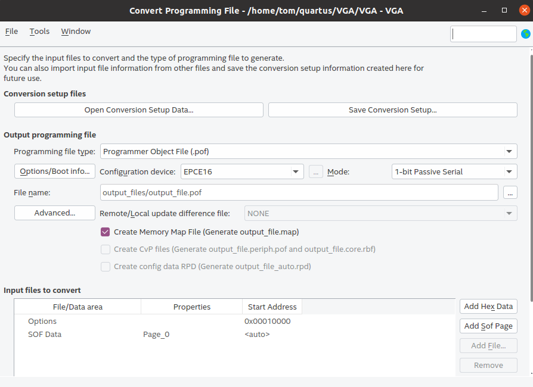
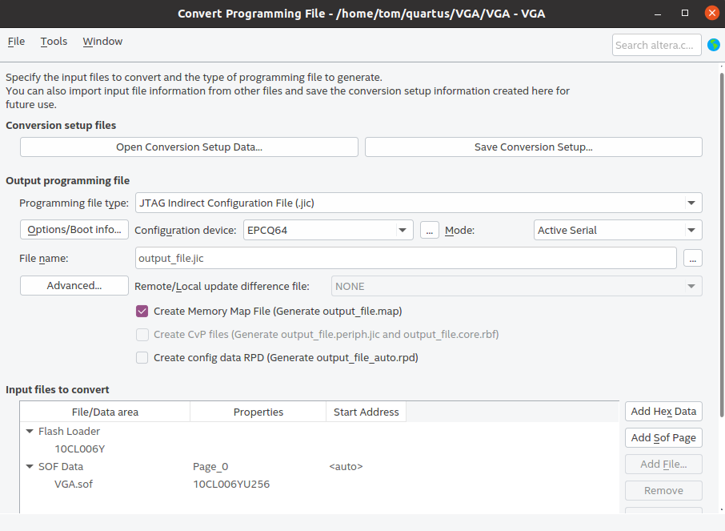

# Overview

My 6502 computer project needed a display and I don't have a VIC chip or anything similar.
So I've recreated the absolute basic features to get *something* displayed on a VGA screen.

There are a few really impressive 6502/C64 re-implementations in FPGA, but I haven't found just
the VIC-II part alone to attach to a discrete 6502.

## Features

Currently only basic character mode works.  You can set character colors and background color.
That's it.  Don't expect to play games or anything fancy.  They usually use sprites and that's not 
implemented.  
## VIC II registers
The information in this secion is research to implement sprites *one day*.  The next step in 
development would be to implement just enough features to run 'gorillas.bas'.

### Sprites (not implemented)

A sprite is a 24*21 pixels + one byte to pad to 64 bytes, 512 bits.

Sprite data location is defined in the last 8 bytes of the Screen/char RAM: 0x7F8-0x7FF.
We can only store a single byte per sprite: 0x00 to 0xFF.  By default VIC uses Bank 0: 
0x0000-0x3000.  When computing the sprite data location, multiple the sprite pointer byte
by 64 (number of bytes in a sprite).  That gives the offset.  If sprite 1 data is stores at
0x3000, then 0x7F8 would be set to 0xC0 (192).  192*64=12288, which is 0x3000.

Note the VIC bank is selected by setting the 2 LSB bits on CIA/VIA2, port A

### Registers

Sprite location

D010 is required since the screen is 512x256, so we need 9 bits for X.  That 9th bit
is kept in D010.
Positions are define by the upper left corner of the sprite.

Note that sprites can move out of the 320*200 area!

* D000 - X Coordinate Sprite 0
* D001 - Y Coordinate Sprite 0
* D002 - X Coordinate Sprite 1
* D003 - Y Coordinate Sprite 1
* D004 - X Coordinate Sprite 2
* D005 - Y Coordinate Sprite 2
* D006 - X Coordinate Sprite 3
* D007 - Y Coordinate Sprite 3
* D010 - MSBs of X coordinates

* D015 - Sprite enabled

Sprite expansion doubles the sprites size by a factor of 2
* D017 - Sprite Y expansion
* D01D - Sprite X expansion
* D01E - Sprite-sprite collision
* D01F - Sprite-data collision
  - sprite collides with anything that's non-sprite and has a color different than D021

* D020 - Border colour
* D021 - Background colour 0
* D027 - Sprite 0 colour
* D028 - Sprite 1 colour
* D029 - Sprite 2 colour
* D030 - Sprite 3 colour

### References:
https://www.c64-wiki.com/wiki/Page_208-211
https://www.c64-wiki.com/wiki/VIC_bank
https://dustlayer.com/vic-ii/2013/4/28/vic-ii-for-beginners-part-5-bringing-sprites-in-shape

## ROM

Dump contents of binary rom in mif style content:

    hexdump  -ve '1/1 "\t%.3_ax : %.2X;\n"' pet-1.bin

Copy and paste the result into a precreated MIF file.  Ensure of generated data
and MIF file match.

## Programming

I'm using a Cyclone 10 board from AliExpress: https://github.com/ChinaQMTECH/QM_Cyclone10_10CL006
Use Quartus to create .jam files.
Use https://github.com/margro/jam-stapl on raspberry pi 1 (doesn't seem to work on newer models with 40 pin header)

Depending on whether you want to temporary configure the FPGA or write to SPI flash, there's a slightly
different approach.  You change the approach in this menu: File->Convert Programming Files

To create a .sof file for direct programming:

To create a .jic file (write to flash):

For details, see: file:///home/tom/Downloads/QMTECH_Cyclone10_10CL006_UserManual-(Quartus17.0)-V02.pdf

To program: go to Tools->Programmer to create the .jam file.  Copy that file to the raspberry pi.
Then on the raspberry pi run following commands.

When .jam file is created for .sof: 
* sudo jam -aconfigure ./Test01_LED.jam -v

When .jam file is created for .jic:
* sudo jam -aconfigure ./Test01_LED_flash.jam -v
* sudo jam -aprogram ./Test01_LED_flash.jam -v

